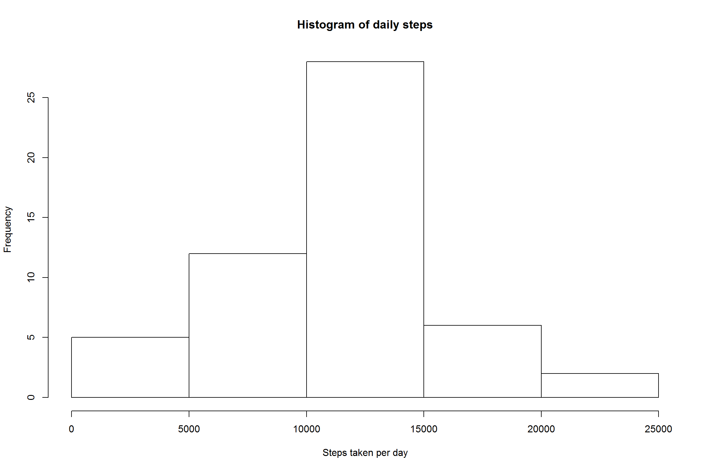
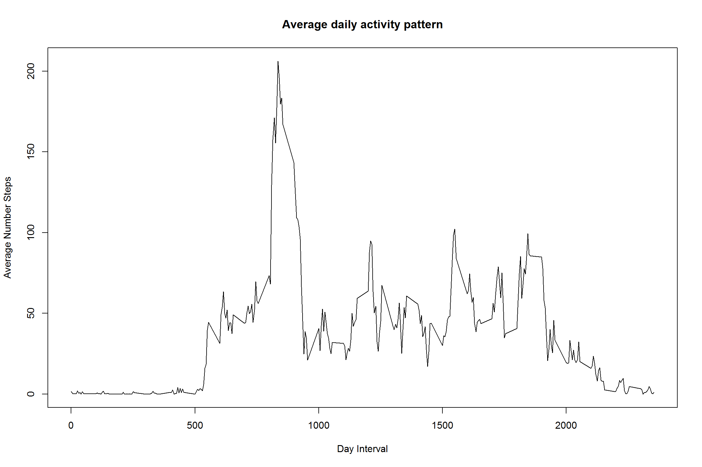
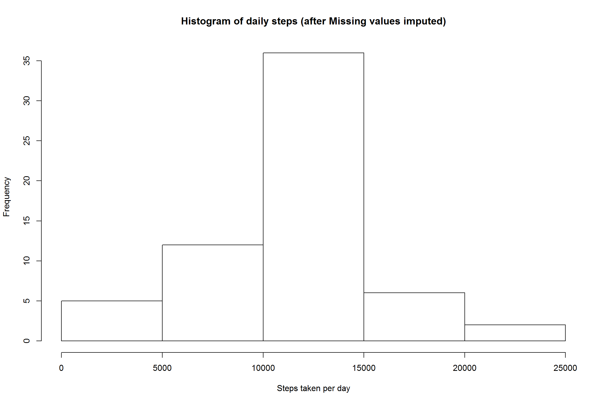
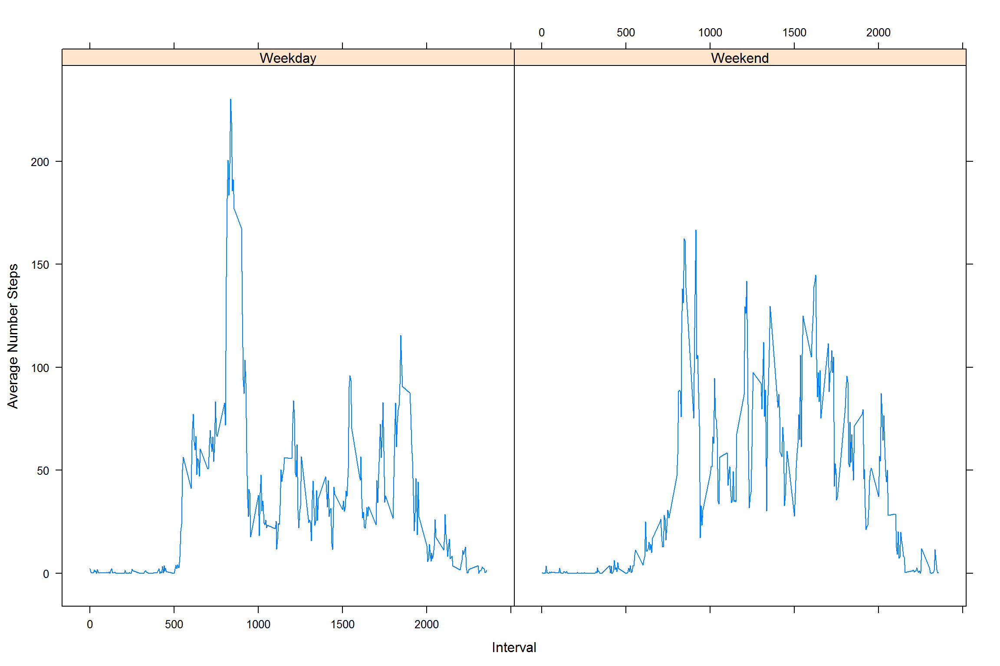

# Step Analysis
It is now possible to collect a large amount of data about personal movement using activity monitoring devices such as a Fitbit, Nike Fuelband, or Jawbone Up. These type of devices are part of the "quantified self" movement - a group of enthusiasts who take measurements about themselves regularly to improve their health, to find patterns in their behavior, or because they are tech geeks. But this data remains under-utilized because the raw data is hard to obtain, as well as there is a lack of statistical methods and software for processing and interpreting the data.

This report makes use of data from a personal activity monitoring device. This device collects data at 5 minute intervals through out the day. The data consists of two months of data from an anonymous individual collected during the months of October and November, 2012 and include the number of steps taken in 5 minute intervals each day.

The variables included in this dataset are:

STEPS: Number of steps taking in a 5-minute interval (missing values are coded as NA).  
DATE: The date on which the measurement was taken in YYYY-MM-DD format.  
INTERVAL: Identifier for the 5-minute interval in which measurement was taken.  

The dataset is stored in a comma-separated-value (CSV) file and there are a total of 17,568 observations

The report will include the following sections in the specified order:  
1. Code for reading in the dataset and/or processing the data   
2. Histogram of the total number of steps taken each day  
3. Mean and median number of steps taken each day  
4. Time series plot of the average number of steps taken  
5. The 5-minute interval that, on average, contains the maximum number of steps  
6. Code to describe and show a strategy for imputing missing data  
7. Histogram of the total number of steps taken each day after missing values are imputed  
8. Mean and median number of steps taken each day after missing values are imputed  
9. Panel plot comparing the average number of steps taken per 5-minute interval across weekdays and weekends  
10. All of the R code needed to reproduce the results (numbers, plots, etc.) in the report 


                      

## 1. Code for reading and processing the dataset

```r
all_data <- read.table("activity.csv",header=TRUE,sep = ",",stringsAsFactors=FALSE)
all_data$date <- as.POSIXct(all_data$date)
data_nona <- na.omit(all_data)
```

  
## 2. Histogram of the total number of steps taken each day


<!-- -->

## 3. Mean and median number of steps taken each day

The mean is 1.0766189\times 10^{4} steps per day.  
The median is 10765 steps per day.  

## 4. Time series plot of the average number of steps taken

<!-- -->

## 5. The 5-minute interval that, on average, contains the maximum number of steps


Day Interval: 835  
Avg. Number of Steps: 206.1698113

## 6. Code to describe and show a strategy for imputing missing data
Create new dataframe by imputing/applying the avg number of steps by interval of completed cases to the observations where step value is NA.

```r
imputed_data <- all_data
imputed_data2 <- transform(imputed_data, steps = ifelse(is.na(steps), ave(steps, interval, FUN = function(x) mean(x, na.rm = TRUE)), steps))
steps_by_day2 <- aggregate(steps ~ date,imputed_data2, sum)
```

## 7. Histogram of the total number of steps taken each day after missing values are imputed
<!-- -->

## 8. Mean and median number of steps taken each day after missing values are imputed  

The mean is 1.0766189\times 10^{4} steps per day.    

The median is 1.0766189\times 10^{4} steps per day.   

### a) Do these values differ from the estimates from the first part of the assignment?   
No (very marginal difference in median)  

### b) What is the impact of imputing missing data on the estimates of the total daily number of steps?      
The impact is that the total number of observations increases and the frequency increases for the number of days that step activity is between 10,000 and 15,000 steps.

## 9. Panel plot comparing the average number of steps taken per 5-minute interval across weekdays and weekends


<!-- -->

## 10. R code needed to reproduce the results (numbers, plots, etc.) in this report
### a. Code for reading in data and reproducing histogram of the total number of steps taken each day (excluding incomplete cases/NAs). 

```r
all_data <- read.table("activity.csv",header=TRUE,sep = ",",stringsAsFactors=FALSE)
all_data$date <- as.POSIXct(all_data$date)
data_nona <- na.omit(all_data)
steps_by_day <- aggregate(steps ~ date,data_nona, sum)
hist(steps_by_day$steps,main = "Histogram of daily steps", xlab = "Steps taken per day")
```
### b. Code for reproducing mean and median number of steps taken each day (excluding incomplete cases/NAs). Review prior code above for dependencies.

```r
mean(steps_by_day$steps)  
median(steps_by_day$steps
```
### c. Code for reproducing time series plot of the average number of steps taken (excluding incomplete cases/NAs). Review prior code above for dependencies.

```r
interval_avg <- aggregate(steps ~ interval,data_nona, mean)
plot(interval_avg$interval,interval_avg$steps, type='l', xlab='Day Interval',ylab='Average Number Steps', main='Average daily activity pattern')
```
### d. Code for reproducing The 5-minute interval that, on average, contains the maximum number of steps. Review prior code above for dependencies.

```r
moststeps <- interval_avg[which.max(interval_avg$steps),]
Day Interval: `r moststeps[1,1]`  
Avg. Number of Steps: `r moststeps[1,2]`
```
### e. Code for reproducing histogram of the total number of steps taken each day after missing values are imputed. Review prior code above for dependencies.

```r
imputed_data <- all_data
imputed_data2 <- transform(imputed_data, steps = ifelse(is.na(steps), ave(steps, interval, FUN = function(x) mean(x, na.rm = TRUE)), steps))
steps_by_day2 <- aggregate(steps ~ date,imputed_data2, sum)
hist(steps_by_day2$steps,main = "Histogram of daily steps (after Missing values imputed)", xlab = "Steps taken per day")
```
### f. Code for reproducing mean and median of steps taken each day after missing values are imputed. Review prior code above for dependencies.

```r
mean(steps_by_day2$steps)  
median(steps_by_day2$steps
```

### g. Code for reproducing panel plot comparing the average number of steps taken per 5-minute interval across weekdays and weekends. Review prior code above for dependencies.

```r
imputed_data3 <- mutate(imputed_data2,wday_ind = isWeekday(imputed_data2$date, wday=1:5))
interval_avg2 <- aggregate(steps ~ interval+wday_ind,imputed_data3, mean)
interval_avg3 <- transform(interval_avg2, wend_ind == ifelse(wday_ind = 'FALSE','Weekend','Weekday'))
xyplot(steps ~ interval|wend_ind,data = interval_avg3, layout = c(2,1),type="l",xlab="Interval",ylab="Average Number Steps")
```
